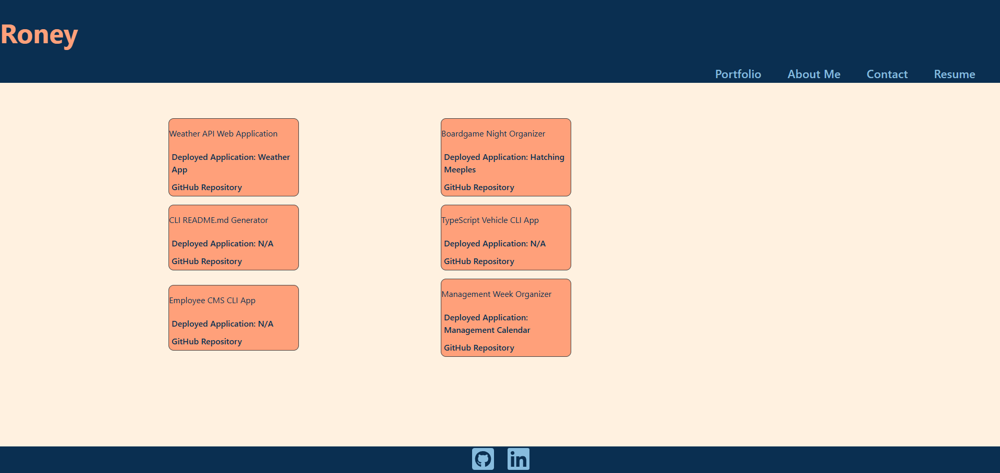

# Project Portfolio in React

## Description

This is a collection fo the projects that I have completed in my programming career thus far. The portfolio is still expanding! Any feedback is welcome.

## Table of Contents
1. [Installation](#installation)
2. [Usage](#usage)
3. [Contributing](#contributing)
4. [Tests](#tests)
5. [Questions](#questions)

## Installation

They can visit my portfolio deployed live at this link: https://joelsreactportfolio.netlify.app/

## Usage

Just visit the web page and browse aroudn the different section to learn more about me and my skillset. This is what you should first see when loading the application:

## Contributing

N/A

## Tests

N/A

## Questions

Github: https://github.com/fluviangumbo/

Email: jroney002@gmail.com

Email me or contact me on GitHub!
